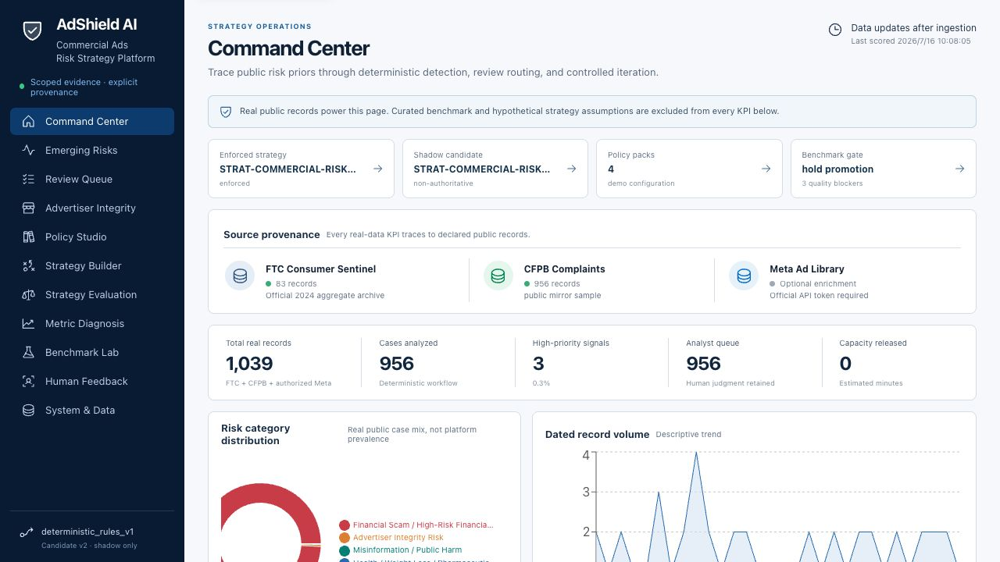

# AdShield AI — a governed risk-review system for commercial ads

**One risky ad should be explainable in a single screen, and one policy change should never ship without evidence.** AdShield AI is a working, bilingual (English / 中文) **governed workflow prototype for commercial ads risk review**: real public harm data in, versioned detection strategies, an explainable review queue, human decisions, and a promotion gate that refuses to enforce what the evidence cannot support.

### [▶ Open the live demo](https://adshield-ai-seven.vercel.app/) — read-only, no login, no API key

**A ninety-second system walkthrough:**

1. **Review Queue → open the top case.** A 16-step decision trace shows the exact matched evidence, score components, policy references, and strategy version — plus why this record can only be routed for analyst research and can never trigger an automated ad enforcement action.
2. **Benchmark Lab.** The enforced v1 strategy scores 50% category / 66.7% routing / 30% exception routing against 60 curated bilingual scenarios; a shadow candidate remediated against those same scenarios reaches 93.3% / 100% / 100%. This is development-set regression coverage, not evidence of generalization to unseen ads.
3. **Launch Readiness.** Despite that clean regression run, promotion is **HOLD**: no authorized ad records, no independent labels, no verified reviewer identity, no SLA history, no policy-owner approval. Passing an offline benchmark is not authority to enforce.

**Why this problem matters:** ads risk teams are judged on decisions they must defend — to advertisers, regulators, and their own reviewers. The hard part is rarely the classifier; it is keeping decision authority, evidence, and iteration safety intact while operating at volume under incomplete information. This project is about that layer.

**Built independently.** The demo includes 956 public CFPB complaint narratives, official FTC Consumer Sentinel 2024 aggregates, and an external ad-perception dataset covering 500 real web ads and 1,025 independent annotators (UW CHI 2021) — alongside 60 curated evaluation scenarios, 67 automated tests, CI, and a scheduled availability monitor. No model is trained on these sources; they supply vocabulary, priors, and external validation for a deterministic rule engine. No fabricated metrics: precision, recall, and F1 render as "Awaiting labels" until real reviewer labels exist.

**Target users:** risk strategy analysts, policy operations analysts, and bilingual (EN/ZH) ad reviewers.

[Product architecture](docs/PRODUCT_ARCHITECTURE.md) · [Strategy lifecycle](docs/STRATEGY_LIFECYCLE.md) · [Decision trace](docs/DECISION_TRACE.md) · [Truth boundaries](docs/DATA_SCOPE_AND_TRUTH_BOUNDARIES.md)

The full operating loop the product demonstrates:

**discover risk → define taxonomy and signals → configure policy → shadow a strategy → detect cases → route decisions → review evidence → diagnose metrics → evaluate tradeoffs → iterate safely**

[](https://github.com/bobaoxu2001/adshield-ai/actions/workflows/ci.yml) [](https://github.com/bobaoxu2001/adshield-ai/actions/workflows/production-smoke.yml)



## What makes it credible

- **Policy configuration is structured and inspectable.** Hierarchical taxonomy, reusable signals, positive exceptions, policy packs, and ownership metadata are persisted as a candidate governance overlay; the existing deterministic engine remains authoritative.
- **Promotion and rollback fail closed.** The current strategy is authoritative; candidate v2.1 stays in shadow. A tested RBAC state machine requires benchmark quality, authorized ads, independent labels, reviewer identity, SLA compliance, policy approval, a release-manager action, and an auditable reason before promotion; rollback restores the prior version without rewriting history.
- **Every decision is traceable.** The Investigation Desk exposes source scope, normalized text, negative and positive signals, unavailable modalities, score and confidence components, policy references, strategy version, routing, optional LLM status, and reviewer feedback.
- **Evaluation scopes never mix.** Real public records, authorized ads, 60 curated benchmark scenarios, hypothetical business assumptions, and test fixtures are isolated.
- **Operational tradeoffs are visible.** Threshold sensitivity, reviewer capacity, routing volume, missed-risk exposure, false-positive scenarios, stage latency, throughput, and illustrative cost/revenue guardrails are displayed with their limitations.
- **Failed gates produce an operating plan.** Benchmark gaps are attributed to taxonomy, routing, evidence, or exception handling with an accountable owner and next test; capacity passing never overrides a quality hold.
- **Metric diagnosis ends in an analyst action.** A plain-language readout identifies whether descriptive movement is driven more by sample mix or within-segment rate before any threshold change is considered.
- **Bounded Mandarin and modality adapters are demonstrated by automated tests.** Coverage includes literal terms, normalized pinyin, character splitting, four explicit homophone substitutions, off-platform signals, and provenance-tagged OCR/ASR text supplied by an authorized upstream service. Novel code words and raw-media understanding remain human-review boundaries.
- **Reviewer operations have explicit controls.** Attributed feedback requires reviewer identity; the governance service enforces RBAC, two-person blind labeling, adjudication, assignment SLAs, and append-only promotion/rollback audit events.
- **Public evidence is used at its real evidentiary level.** A pinned UW research source contributes aggregate evidence from 500 real web ads, 1,025 independent annotators, and 5,104 ratings. It expands external validation without being mislabeled as TikTok enforcement truth; a separate official TikTok Commercial Content API connector activates only with approved research access.

## Product surfaces

| Surface | Operating decision |
|---|---|
| Command Center | What evidence is loaded, and what is explicitly excluded from real-data KPIs? |
| Emerging Risks | Which recent evidence terms, n-grams, and source/category mix changes merit investigation? |
| Review Queue + Investigation Desk | Why was this case prioritized, under which strategy, and what must a human decide? |
| Advertiser Integrity | What content-, campaign-, or advertiser-level evidence is actually available? |
| Policy Studio | Which taxonomy, signals, exceptions, and policy packs are active and versioned? |
| Strategy Builder | How would a candidate configuration route work in shadow mode? |
| Strategy Evaluation | How do thresholds affect review load, missed-risk scenarios, and illustrative business guardrails? |
| Metric Diagnosis | Is a change driven by sample composition or within-segment rate, and is the system healthy? |
| Benchmark Lab | How does deterministic behavior compare with 60 curated labels? |
| Human Feedback | Which quality metrics are eligible only after valid reviewer labels exist? |
| Public Evidence | Which real public sources are loaded, what do their labels mean, and which production gates can they never satisfy? |
| Launch Readiness | Which benchmark, data, labeling, identity, SLA, approval, and rollback gates pass—or correctly block production? |
| System & Data | What can each data scope support—and what can it never support? |

## Truth boundaries

AdShield AI has no access to private platform systems, proprietary enforcement decisions, advertiser history, or internal labels. It now includes a strict authorized-batch validation contract, but the public snapshot still contains none of those records.

- CFPB complaints are scrubbed public consumer narratives, not advertisements or verified violations. They can only produce research-prior routing, never ad approve/reject actions.
- FTC data is aggregate reported consumer-harm evidence, not ad-level labels.
- Meta Ad Library creative ingestion is optional and only runs with an authorized token. The public snapshot currently contains no Meta creatives and shows an explicit empty state.
- The UW Ad Perceptions source contributes aggregate external-validation evidence from real web ads and independent participant opinions. It is not an enforcement-label source and cannot unlock production quality gates.
- TikTok Commercial Content API ingestion is implemented against the official API, but remains an explicit zero-record state until approved `research.adlib.basic` access is configured.
- Curated benchmark scenarios are hypothetical and never enter real-public dashboard KPIs.
- Precision, recall, F1, accuracy, false-positive rate, and false-negative rate remain unavailable without eligible labels.
- All financial and capacity values are labeled **“Illustrative scenario assumptions, not observed business values.”**
- LLM evaluation is optional, reviewer-triggered, non-authoritative, and empty unless a real authorized call runs.

See [Data Scope and Truth Boundaries](docs/DATA_SCOPE_AND_TRUTH_BOUNDARIES.md).

## Architecture

```text
FTC archive + CFPB API/mirror + optional authorized Meta API
                         │
              manifests + normalized Parquet
                         │
                         ▼
       taxonomy → signals → exceptions → policy packs
                         │
                         ▼
          current strategy + candidate shadow strategy
                         │
                         ▼
 evidence extraction → scoring → source guardrail → routing
                         │
                         ▼
 DuckDB decision/benchmark marts → FastAPI → React workspace
                         │
                         ▼
 attributed feedback → independent labels → SLA monitor → controlled promotion / rollback
```

The deployed demo uses a tracked, read-only DuckDB snapshot. Local runs persist attributed reviewer feedback separately from original decisions. The production-control domain service is implemented and tested; a real deployment still needs a governed identity provider, durable store, and authorized data. See [Product Architecture](docs/PRODUCT_ARCHITECTURE.md), [Strategy Lifecycle](docs/STRATEGY_LIFECYCLE.md), and [Production Governance](docs/PRODUCTION_GOVERNANCE.md).

## Real public data

| Source | Permitted use | Current demo |
|---|---|---|
| [FTC Consumer Sentinel 2024](https://www.ftc.gov/reports/consumer-sentinel-network-data-book-2024) | Aggregate category and harm priors | Loaded |
| [CFPB Consumer Complaint Database](https://www.consumerfinance.gov/data-research/consumer-complaints/) | Vocabulary, taxonomy input, research prioritization | 956 scrubbed narrative records |
| [UW CHI 2021 Ad Perceptions](https://badads.cs.washington.edu/datasets.html) | Aggregate external validation from real web ads and independent opinions | 500 ads / 1,025 annotators / 5,104 ratings loaded |
| [Meta Ad Library API](https://www.facebook.com/ads/library/api/) | Authorized public ad creatives | Optional; explicit empty state without token |
| [TikTok Commercial Content API](https://developers.tiktok.com/products/commercial-content-api/) | Approved public ad and advertiser metadata | Connector ready; approval token required |
| Public ad-policy guidance (Google Ads, Meta Advertising Standards, TikTok, FTC) | Short source-linked policy summaries, mapped per risk category | 25 rules; each core category grounds in multiple platforms |

Raw retrievals are timestamped locally; normalized data and the writable mart are reproducible and Git-ignored. The deployment snapshot contains only the public fields required by the read-only product.

## Run and verify

Prerequisites: Python 3.11+, Node 20+, `uv`, and `npm`.

```bash
make install
make ingest
make transform
make test
npm run build
make app
```

Open `http://127.0.0.1:8501`. Optional credentials belong only in a Git-ignored `.env`:

- `META_ACCESS_TOKEN` enables authorized Meta Ad Library ingestion.
- `TIKTOK_RESEARCH_ACCESS_TOKEN` enables the official TikTok connector after research approval.
- `OPENAI_API_KEY` enables an explicit, non-binding LLM comparison.

No credential is required for the deterministic public-data demo.

## Data model

Core tables include:

- Evidence: `ftc_fraud_categories`, `cfpb_complaints`, `ads`, `ad_risk_scores`, `policy_rules`
- Governance: `risk_taxonomy_versions`, `risk_signals`, `risk_exceptions`, `policy_packs`
- Lifecycle: `strategy_versions`, `strategy_assignments`, `strategy_shadow_results`, `decision_trace`
- Evaluation: `curated_benchmark_cases`, `benchmark_results`, `emerging_risk_candidates`
- Human loop: `human_review_feedback`, `reviewer_identity_audit`, independent assignments/labels/adjudication adapter contract

## Evaluation

The repository contains 60 isolated curated scenarios: 15 English, 15 Mandarin, 10 evasion/mixed-language, 10 positive-exception, and 10 advertiser-behavior cases. Reported benchmark values are agreement or coverage against those curated labels—not production quality metrics. Threshold sensitivity is calculated across the same isolated scope.

The frozen v1 benchmark is 50% category, 66.7% routing, and 30% exception routing. Shadow v2.1, evaluated against the same labels, reaches 93.3%, 100%, and 100%.

**These 60 scenarios are a development set, not a test set.** Candidate v2.1's category-precedence and routing rules were written while remediating these specific failures, so its agreement is *regression coverage over known defects* — not evidence that it generalizes to unseen ads. To measure that gap honestly, an 18-scenario **held-out set** authored *after* v2.1 was frozen (Benchmark Lab → Held-out generalization, `/api/holdout-benchmark`) shows v2.1 dropping from 93.3% / 100% to **50.0% / 72.2%** category / routing — still ahead of v1 (27.8% / 55.6%), but far below the tuned score. Launch Readiness correctly remains **HOLD** because the external labels are not authorized platform enforcement truth and organization-verified identity, reviewer SLA history, and policy approval are still absent.

The [UW ad-perception dataset](docs/EXTERNAL_VALIDATION_UW.md) is used at its real evidentiary level: the ads are image screenshots with no text, so the engine cannot score them; instead, category-level analysis shows independent human deception perception concentrates in exactly the health and deceptive-claim areas the taxonomy prioritizes — external corroboration of the risk ranking, not per-ad agreement.

Rule-vs-LLM comparison reports category, evidence, routing, unsupported-evidence heuristic, latency, failure, and cost availability. Without an authorized call, every LLM metric remains empty rather than fabricated.

See [Benchmark Methodology](docs/BENCHMARK_METHODOLOGY.md) and [Strategy Evaluation](docs/STRATEGY_EVALUATION.md).

## Documentation

- [Product Architecture](docs/PRODUCT_ARCHITECTURE.md)
- [Risk Taxonomy](docs/RISK_TAXONOMY.md)
- [Policy Studio](docs/POLICY_STUDIO.md)
- [Strategy Lifecycle](docs/STRATEGY_LIFECYCLE.md)
- [Decision Trace](docs/DECISION_TRACE.md)
- [Advertiser Integrity](docs/ADVERTISER_INTEGRITY.md)
- [Risk Scoring Methodology](docs/RISK_SCORING_METHODOLOGY.md)
- [Benchmark Methodology](docs/BENCHMARK_METHODOLOGY.md) — development set vs held-out generalization
- [Strategy Evaluation](docs/STRATEGY_EVALUATION.md)
- [Metric Dictionary](docs/METRIC_DICTIONARY.md)
- [Data Scope and Truth Boundaries](docs/DATA_SCOPE_AND_TRUTH_BOUNDARIES.md)
- [External Validation (UW ad perceptions)](docs/EXTERNAL_VALIDATION_UW.md)
- [Public Evidence Register](docs/PUBLIC_EVIDENCE_REGISTER.md)
- [Real Ads Enrichment (Meta connector)](docs/REAL_ADS_ENRICHMENT.md)
- [Production Governance](docs/PRODUCTION_GOVERNANCE.md)

## Responsible use

This is a decision-support prototype, not a legal conclusion or autonomous enforcement service. Risk scores prioritize review and are not calibrated probabilities. Public complaint volume is not market-share adjusted and cannot establish prevalence or company misconduct. High-severity exceptions never silently clear risk; ambiguous, market-specific, and source-limited cases remain human decisions.
